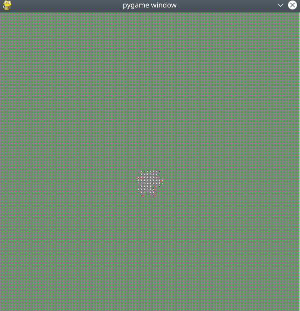
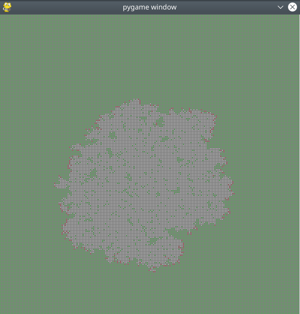
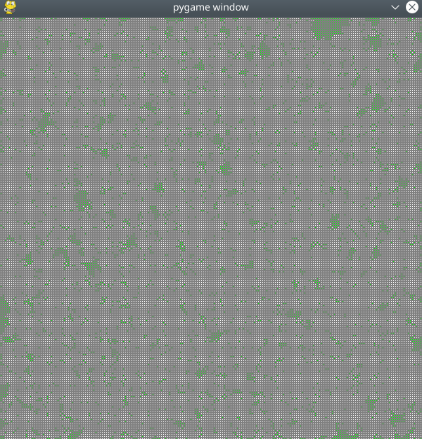
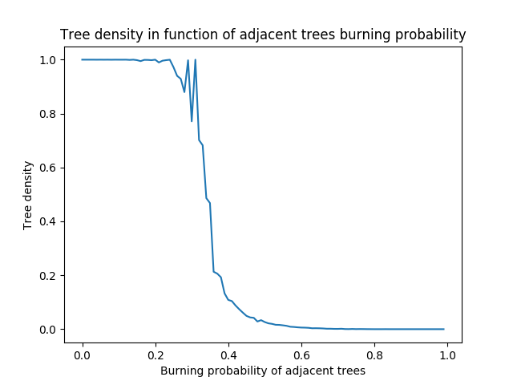

# Forest fire simulator
Multiagent systems course, cellular automaton example.

 At each step, each cell of the grid represents either a tree, a fire, or a burnt tree. If a cell is on fire, adjacent trees* can burn with some probability. At the next step, all cells on fire are "burnt" and cannot be on fire again. Simulation ends when there are no more cells on fire.

\* adjacent trees refer to all neighbors of a cell, taking the diagonals into account 

## Instructions

### Simulate one run with Pygame visualisation
   
Run on a 200x200 forest with 1 fire at the beggining and probability that an adjacent tree burns of 0.6:
```python
    forest = Forest(200, 1, p=0.4)
    play(forest)
```

#### Results (early, mid, end of the run):


 


### Simulate runs for different probabilities and plot trees densities in function of neighbors probability of burning 

Example on a 100x100 forest with one fire at the beggining, 5 simulations episodes per run and a difference of 0.01 between tested probabilities:
```python
    densities_list, p_list = sim(
        min_p=0, max_p=1, delta=0.01, n=100, num_fires=1, num_episodes_per_run=5)

    plot(densities_list, p_list)
```

#### Results:

